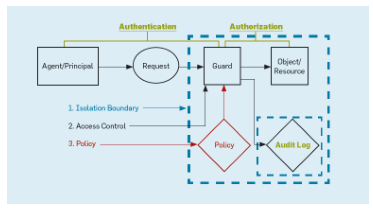
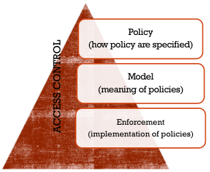
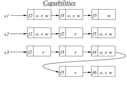
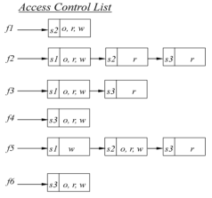
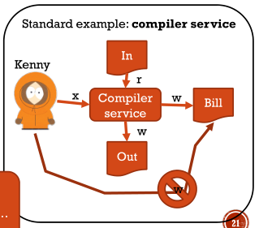
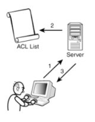
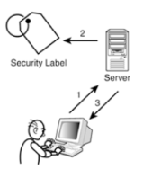
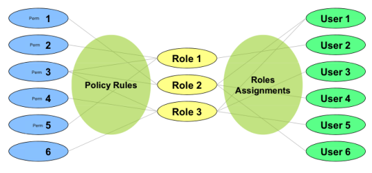
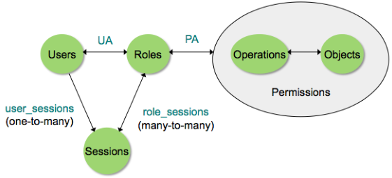
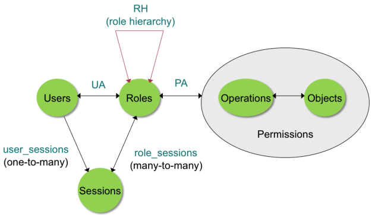

# Access Control
Access control can be explained in a very simple way as follow:

There are some important boundaries:

* outer one prevent the by-passing of the **Guard**. All authorization must pass through it and some privileges are required in order to by-pass the Guard;
* inner one guarantees the integrity of the audit log. Inside it is written what happen and why. Contrary to the outer boundary, the inner one cannot be by-passed in any way.

A good example can be an operative system. Inside it may be multiple users operating in different environments. The OS must provide some protections between users:

* memory protection
* file protection
* general control and access to objects
* user authentication

So a tradeoff must be set during the design of an OS between *sharing* and *protection*. A three levels of protection are:

* no protection
* isolation → each process own portion of memory, files, etc. And OS provides boundaries
* share → some resources still need to be shared. For example libraries, files, database, etc.

If a share approach is used a good principle is ***Least Priviledge***: every subject must be able to access only the information and resources that are necessary for its legitimate purpose. This principle can be implemented through resource encapsulation and OS can apply it also on users management (not only resources management).

## Definition
Access control is the process of mediating requests to resources and data of system and determining whether a request should be granted or denied.

The flow can be summarized as follow: subject *s* wants to perform action *a* on resource *r*

1. access request *(s, a, r)* is sent to access control module
2. access control module returns grant/deny
3. if response is grant system allow *s* to perform *a* on *r*

The main purpose of *AC* is to protect resources from unauthorized accesses.

## Structure
The structure of an *AC* is:

* policy → rules that contro what actions, subjects may perform on resources containing information;
* model → forma representation of the policy and its working;
* enforcement → low level functions that implements the controls imposed by the policy.

When policy and model are mathematical defined an automated reasoning can be used as enforcement.

## AC models

### ACM
An **Access Control Matrix** (ACM) can be used to store if a subject can perform some actions on an object.

To check the *ACM* to ways are possible:

* capabilities → user is linked to the file:
    * owned
    * can read
    * can write

* access control list → file is linked to the user that:
    * own it
    * can read it
    * can write it
    * 

There is a vulnerability that exploit the privilege of a file using privilege escalation. A user can use another program to overwrite a file without the permission (only if the program used has the permission to do that).

For this operation following queries are performed:

* (Kenny, x, Compiler)
* (Compiler, r, In)
* (Compiler, w, Bill)

All of these are granted assuming the following ACLs:

* Compiler → [Kenny | x]
* In → [Kenny | o, r, w]
* Bill → [Compiler | w]

So the compiler is delegated by Kenny to read its source file In and at the same tie by the OS to write the billing file Bill.

TO solve this problem a different ACLs can be used:
* Kenny → [Compiler | x] → [In | r]
* Compiler → [Bill | w]

### DAC
Model in which subjects can give rights to other subjects (DISCRETIONARY). DAC is known as too flexible model and is used typically in operating systems.

The policy is that owner of a resource decides how it can be shared implemented through ACL.

Groups can be defined in order to simplify the management of users' rights.

#### Pros and cons
| Pros | Cons|
|:---:|:---:|
|Flexible|Subjective: owner of a file decide on his taste the protection level|
|Implementation well understood|Vulnerabile to Trojans[^trojan]|
|Intuitive|

### MAC
Model in which user operates in an organization and it is the latter that decides how data should be shared. Usually enforced by using security labels.

#### Pros and Cons
| Pros | Cons|
|:---:|:---:|
|Not vulnerable to trojans (because no write down)|Information leakage still possible by covert channel|
|Rigid: easy keep control|Rigid: may hinder business continuity|

### Multi-Level Security
Model in which there are various sensitivity levels and users have various degrees of trustworthiness. Them management is made with a policy create to prevent the release of sensitive information to untrusted users.

Information is compartmentalized into separate containers labeled according to their sensitivity label *L = (S, N)* where S takes values over a linearly ordered set. With this technique at creation time a resource is associated to a sensitivity label by resource originator according to some criteria. If a document contain high and low sensitivity information at the same time the label must be the highest sensitivity (at the same time the label can be downgraded).
After label is set the next step is assign clearances in order to choice which users are authorized to access which resources. Each user is associated to a clearance *C = (S, N)* where:

* S is a hierarchical security level indicating the degree of trustworthiness to which the user has been vetted
* N is a set of need-to-know categories indicating domains of interest in which the user is authorized to operate

The policies are defined by using sensitivity labels and clearances. The two property are:

* ***No Read Up Property*** → subject *s* can read resource *r* if *(Ss, Ns)* dominates *(Sr, Nr)*[^domination]. *s* asking to read the content of *r* must show its clearance dominates the sensitivity label of *r*. 
* ***No Write Down Property*** → subject *s* can write to resource *r*  if *(Sr, Nr)* dominates *(Ss, Ns)*. *s* asking to write to a resource must show that its clearance is dominated by the sensitivity label of the resource.

No write down property exist to prevent that a subject to a top Secret file may copy the information into an unclassified file. It is also needed the tranquility principle, it prevents the ability to change security labels arbitrarily as this can subvert security (subject with high levels cannot move into a lower level to pass confidential information).

#### Bell-La Padula model
Bell-La Padula model is based on no read up, no write down and tranquility principle.

### Role Based
Permissions are assigned to roles rather than to individual users, after that roles are assigned to users. This level of indirection simplify the management and provide additional security benefits.

#### Role Definition
A role is a job function within the context of an organization, with some associated semantics regarding the authority and responsibility conferred to the subjects to whom the role is assigned.

#### Roles vs groups
Groups are collections of users, roles instead are a collection of users and a collection of permissions.

#### User-role-permission relation
The user-role relation is a many-to-many.

The role-permission relation is many-to-many.

#### Sessions
A user can invoke multiple sessions and in each session a user can invoke any subset of roles that the user is a member of.

---

#### Core RBAC

Where:

* *U, R, P, S* means users, roles, permissions and sessions
* $U\times R \supseteq UA$ is a many-to-many user-role assignment binary relation
* $P\times R \supseteq PA$ is a many-to-many permissions-role assignment binary relation
* $user : S \to U$ is a function mapping each session s to a user
* $roles : S \to 2^R$ is a function mapping each session s to a set of roles roles(s) such that $\{r | (user(s), r) \in UA\} \supseteq roles(s)$
* $permissions: S \to 2^P$ is a function mapping each sessions s to a set of permissions(s) which is the union of the set $\{p | (p, r) \in PA\}\ \forall r \in roles(s)$

#### RBAC

Where:

* *U, R, P, S, UA, PA* same as core RBAC
* $R\times R \supseteq RH$ is a partial order on R
* $roles : S \to 2^R$ is a function mapping each session s to a set of roles roles(s) such that $\{r | \exists\ r'\ s.t.r' \ge r \land (user(s), r') \in UA\} \supseteq roles(s)$
* $permissions: S \to 2^P$ is a function mapping each sessions s to a set of permissions(s) which is the union of the set $\{p | \exists\ r'\ s.t.r \ge r' \land (p, r') \in PA\}\ \forall r \in roles(s)$

In RBAC there are some constraints: separation of duty (SoD). They are known also as 4 eyes principle, it is widely recognized and captures conflic or interest policies to restrict authority of a single entity (key of fraud prevention).

The main pros and cons are:

| Pros | Cons|
|:----:|:---:|
|Easy to grasp the idea of roles|Difficult to decide the granularity of roles|
|Easy to mange in principle|Role meaning is fuzzy|
|Easy to tell through roles which permissions a subject has and way||

[^trojan]: Resource R only readable by Alice. Bob induces Alice to run a trojan that can read R and copy information to R' readable by Bob. Bob can rad R' and thus also the information in R.
[^domination]: $(S1, N1)$ dominates $(S2, N2)$ if and only if: $S1 \ge S2 \land N1 \supseteq N2$
