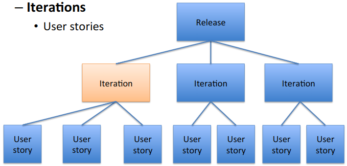
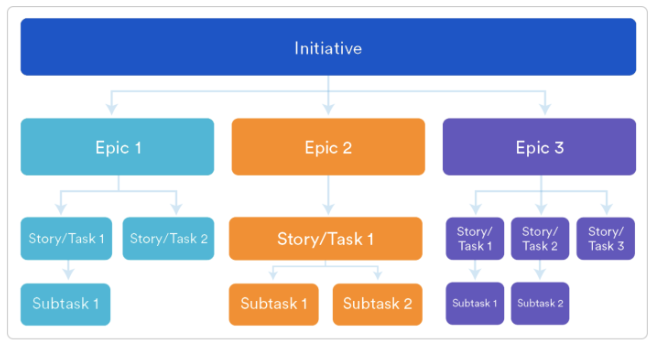

# Agile development
The agile development relies on an iterative approach. This can help to achieve rapid and flexible response to changes. For these reasons agile methods processes foresee short iteration with evolutionary review of requirements, plans and project. All parts involved are:

* iterations include all steps
* embrace change
* get feedback
* stability of requirements over time

#### Flexible
Flexible software is software composed by flexible code that is easy to change and understand

## Manifesto for Agile Software Development
There are some principles:

1. *Our highest priority is to satisfy the customer through early and continuous delivery of valuable software.*
2. *Welcome changing requirements, even late in development. Agile processes harness change for the  customer's competitive advantage.*
3. *Deliver working software frequently, from a couple of weeks to a couple of months, whit a preference to the shorter timescale.*
4. *Business people and developers must work together daily throughout the project.*
5. *Build projects around motivated individuals. Give them the environment and support they need, and trust them to get the job done.*
6. *The most efficient and effective method of conveying information to and within a development team is face-to-face conversation.*
7. *Working software is the primary measure of progress.*
8. *Agile processes promote sustainable development. The sponsors, developers, and users should be able to maintain a constant pace indefinitely.*
9. *Continuous attention to technical excellence and good design enhances agility.*
10. *Simplicity--the art of maximizing the amount of work done--is essential.*
11. *The best architectures, requirements and designers emerge from self-organizing teams.*
12. *At regular intervals, the team reflects on how to become more effective, then tunes and adjusts its behaviour accordingly*

The agile process is expressed through:

* who → roles
* what → activities
* how → methodologies
* when → timing

## Advantages
The main advantages are:

* lower risk of failure compared to waterfall model;
* higher productivity;
* earlier and continuous feedback;
* complexity management;
* continuous learning from previous iterations
* feedback

## Common practices

$$
Release \to Iterations \to User\ stories
$$

### Iteration
Iteration is "solid", user requirements can't change during an iteration

### User story
A user story is an end goal, not a feature, expressed from the software user's perspective. The main purpose of a _US_ is to articulate how a piece of work will deliver a particular value back to the customer.

The definition follow this format:
$$
As\ a\ [user],\ I\ [want\ to],\ [so\ that]
$$

*US* helps:

* keep the focus on the user
* enable collaboration
* drive creative solutions
* create momentum

### Epic
An EPIC is a high-level body of work that bands together with a group of related stories

### Epic VS User story
| User story                                                                 | Epic                                                       |
|----------------------------------------------------------------------------|------------------------------------------------------------|
| Smallest uni of work; can't be split anymore                               | Cab be broken down into more specific and smaller elements |
| Fit a shippable product increment that should be delivered during 1 sprint | May be implemented during few sprints                      |
| Represents some value that user will get after implementation              | Indicates a more general task                              |
| Quite easy to estimate                                                     | Harder to estimate since the scope is flexible             |

---

Examples of agile development are:

* [[[scrumDevel]]]
* [[[kanbanDevel]]]
* Scrumban → a scrum with:
    * visualization
    * WIP limit
    * workflow management
