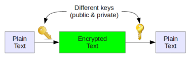
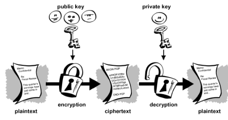
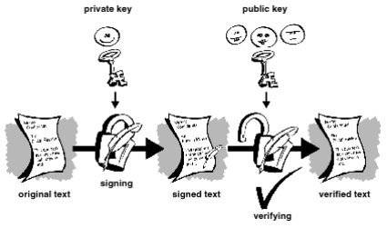
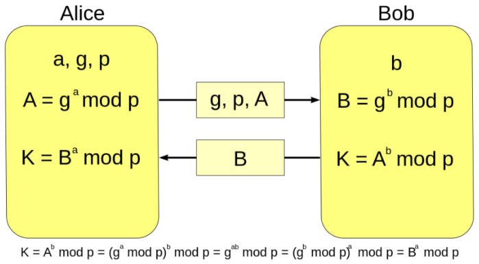
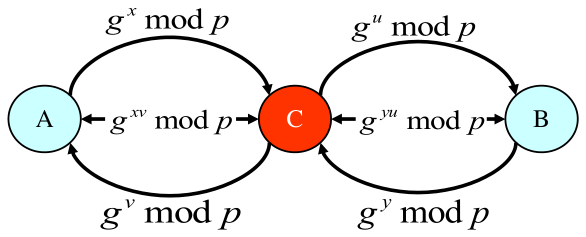
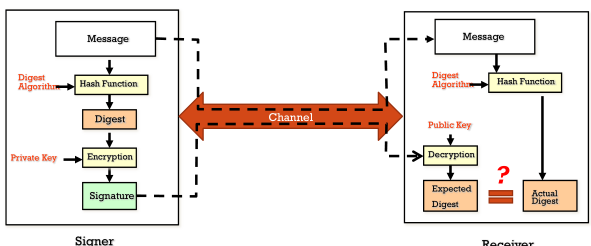

# Asymmetric key encryption
Asymmetric key encryption, also known as **Public Key Cryptography**, is a two key crypto system in which two parties could engage in a secure communication over a non-secure communications channel without sharing a secret key.

This is possible because there are functions called **one-way functions** which are easy to compute whereas their inverse function is relatively difficult to compute. Two example are:

* multiplication vs. factorization
* exponentiation vs. logarithms

The basic idea is to use two keys: one to encode and the other to decode

Two keys must be not related, so the knowledge of one does not involve the knowledge of other. One become public and can be viewed and used by anyone, other become private and must be store in a secure way. A this point there are two possibile scenarios:

#### Encrypted message

1. Alice encrypts some information with Bob's public key;
2. only Bob, with his private key, can decrypt Alice's message.

#### Signed message

1. Alice encrypt some plain text with her private key;
2. Bob decrypt the message with Alice's public key. For this reason he knows that Alice sent the message (authentication[^auth]), Alice cannot deny having sent the message (non-repudiation[^non-repudiation]) and also none alters the message during the transit (integrity[^integrity]). 

## RSA (Rivest, Shamir, Adleman)
RSA is based on mathematical trick that is easy to compute products compared to computing factorizations. It is used widely for key exchange, digital signatures or encryption of small blocks of data.

RSA uses variable size encryption block and variable size key. Public and private keys are built from a very large number calculated from the product of two primes (from 100 to 200 digits).

### Factorization
Let $p$ and $q$ to large primes. Let $N=p*q$ be the modules. Choose a relatively prime to $(p-1)*(q-1)$ and find $d$ from $e*d=1\ mod\ (p-1)(q-1)$. Public key an private key are respectively:

* $(N,e)$
* $d$

To encrypt plaintext $0<M<N$:
$$
C=M^e mod\ N
$$
To decrypt cipherText $C$:
$$
M=C^d mod\ N
$$
because
$$
C^d mod\ N=(M^e mod\ N)^d mod\ N=M^{e*d} mod\ N=M mod\ N=M
$$
in which N and e is public.

### Vulnerability
In early 2012 a vulnerability over RSA was discovered. It involves key generation including 1024 and 2048 bits length. This vulnerability needs only public key and from that is possible to get the private one. The problem that can insorge are:

* private key can be misused for impersonation of legitimate owner, decryption of sensitive messages, forgery of signatures and other related attacks;
* currently confirmed number of vulnerabilities keys found is about 760.000 but possibly up to two to three magnitudes more and vulnerable.

## DH (Diffie-Hellman)
DH was invented after RSA and now it is used for secret-key key exchange only, not for authentication or digital signatures. The mathematical trick on which DH rely is the simplicity of computing exponents over computing discrete logarithms.

### Math
Finite field $F=GF(p)=\ integers\ modulo\ p$. At this point exponential is the one way function easy to compute:
$$
x \to g^x (mod\ p)
$$
Instead, the difficult one is **Discrete Logarithm Problem (DLP)**. Given $p,g,X$ find the discrete logarithm $x$ so that
$$
X = g^x mod\ p
$$
where $p$ is prime and $g$ is a generator.

### Security
Security of *DH* depends on the difficult of *DLP*. *DH* is a key agreement protocol: assuming that *DHP* is difficult, an attacker observing the messages exchanged does not learn the key.

Another important point is that *DH* does not provide authentication[^auth], parties do not know whom they are establishing a key with. For this reason **Man-In-The-Middle** (MITM) can be used.

---

Principal pros of Public Key Crypto are:

* private key is only known by the owner;
* integrity [^integrity] and confidentiality by encrypting with receiver's public key;
* non-repudiation [^non-repudiation] by encrypting with sender's public key.

Principal cons are:

* algorithms are 2-3 orders of magnitude slower than those for symmetric encryption;
* how public keys are available to public people;
* problem related to authentication[^auth]. Who ensure pair composed by public-private keys and person is valid?

In order to mitigate the cons a digital signature can be used. A data item that vouches the origin and the integrity of the message. But the use of digital signature introduce a new problem: who guarantees that the one using the key is entitled to do so? This can be solved using digital certificates[^digitalCert]

A good summary image that reflect an use-case in real life is:

In real life hash functions are used, requirements for a hash function are:

* **Ease of computation** → given $x$, it is easy to compute $h(x)$.
* **Compression** → $h$ maps inputs $x$ of arbitrary bit-length to outputs $h(x)$ of a fixed bit-length $n$.
* **One-way** → given a value $y$, it is computationally infeasible to find an input $x$ so that $h(x)=y$.
* **Weak collision resistance** → give an input $x$ and $h(x)$, it is computationally  infeasible to find another input $x' \land x \neq x' \land h(x) = h(x')$.
* **Strong collision collision resistance** → it is computationally infeasible to find any two inputs $x$ and $x'$ with $x\neq x' \land h(x)=h(x')$.

An example could be:

* **GOAL** → protect program $x$
* **IDEA** → compute $h(x)$ and store result in a secure place
* **VERIFICATION** → anytime is possible to recompute $h(x)$ and check the result with the result stored in a secure place, if the outputs are different something was compromised

[^auth]: you can read more about authentication in [[[ciaTrade]]] and [[[icns]]] and [[[authentication]]]
[^non-repudiation]: you can read more about non-repudiation in [[[ciaTrade]]] and [[[icns]]]
[^integrity]: you can read more about integrity in [[[ciaTrade]]] and [[[icns]]]
[^digitalCert]: you can read more about digital certificates in [[[sslTls]]]
