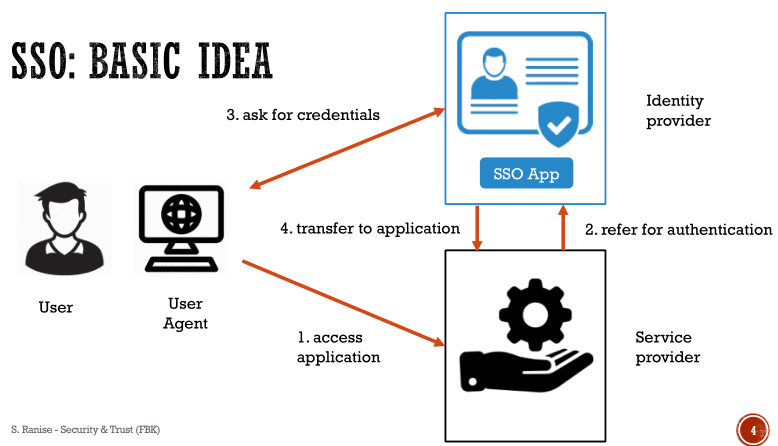
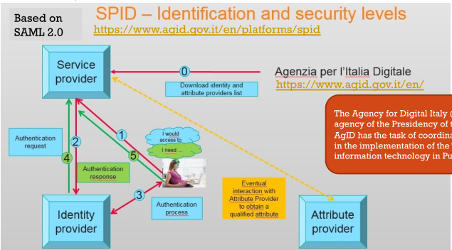
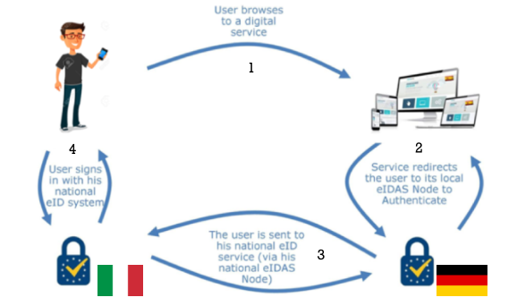
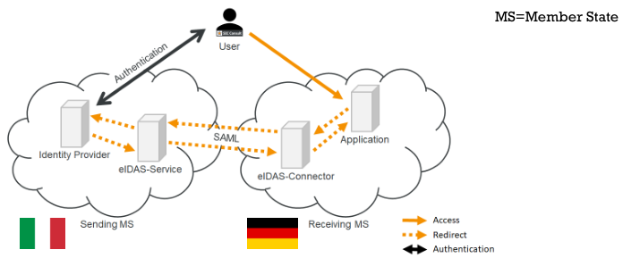

# Authentication

## Single sign on (SSO)
Single sign on was born to overcome the difficult of remember or manager many passwords from many sites/services.
The more security domains[^secDomain], the more sign-ons required

Main properties are:

* credentials never leave the authentication domain
* service providers (affiliated domains) have to trust the authentication domain
* authentication transfer has to be protected

## SAML
SAML stands for *Security Assertion Markup Language*. It is a common language and flow between systems that want to provide an SSO experience users.
Data format uses an XML like format and can be:

* authentication data
* authorization data

The two main entity of SAML are:

* ***identity provider*** (IdP) → tasks:
    * authenticates the user
    * provides authorisation information
* ***service provider*** (SP) → a server that hosts protected resources driven from information provided by the IdP. It uses local access policies to regulate access to protected resources.

When these entities are grouped together and are managed together sharing same common policy form a federation. 

### History
Version 1.0 was defined in 2002.
Version 2.0 was defined in 2005.

### Scenario
A possible scenario can be:

1. Alice visits an airplane website for making her trip;
2. for booking her flight, she provides her credentials to airline website;
3. after booking, she found a link to car rental;
4. she visits car rental website;
5. now Alice can rent a car without signing in again because authentication has been communicate between sites.

### Authentication flow
SAML authentication flow can be summarized as follow:

1. user wants to access an **SP**;
2. user is redirected to a **discovery service** (internal or external, user's choice **IdP**);
3. user goes back to the **SP** with the ID of his own **IdP**;
4. user is redirected to the **IdP**;
5. authentication is performed by the user;
6. user goes back to the **SP** with the authentication.

### Internal structure
The internal structure of SAML is composed by:

* a single stack composed by:
    * ***profiles*** → profiles are a composition of protocols, assertions and bindings combined to crate a federation and enable federate single sign-on. Some profiles are:
        * web browser signle sign-on
        * single logout → if user is using signle sign-on a federation he has established sessions with mebers of federation. Sessions are managed by a session authority (in many cas is **IdP**). Session authority can use single logout to end all sessions.
        * artifact resolution
    * ***bindings*** → mechanism used to transport messages between requesters and responders.
    * ***protocols*** → flow of assertions query and request for obtaining SAML assertions.
    * ***assertions*** → set of statements made by a SAML authority:
        * authentication assertion → issed byu a party that authenticates users
        * attribute assertion → id defines specifi details about he Subject
        * authorization assertion → it defines something the Subject is entitled to do
* ***authentication context*** → indicates how a user authenticated at an Identity provider. Context is included from **IdP** during assertion after **SP** request. Can be used to set different levels of authentication.
* ***metadata*** → document that describes the SAML deployment. Minimum content is:
    * Entity ID → unique identifier used in software configurations;
    * Cryptographic Keys → used to sign SAML messages;
    * Protocol Endpoints → used to verify encrypted signed message.

#### Web SSO profiles
A possible SSO scenario can be:

1. user has login session at www.first.com;
2. user move to www.second.com (assuming first and second has established previously a federal identity);
3. identity provider www.first.com asserts to service provider site www.second.com that the use is known;
4. since www.second.com trusts www.first.com, user authentication is valid and a local session for the user is created.

In details:

1. user is challenged to supply credentials to the **IdP** site;
2. user provides valid credentials and a local logon **security context** is created;
3. user moves from **IdP** to the **SP** site. This causes the **IdP**'s SSO service to be called;
4. SSO service builds **SAML assertion** representing logon security context;
5. browser issues an HTTP POST request to send a form to the **SP**'s Assertion Consumer Service;
6. final access check to allow/deny user access to resource.

A second possibile SSO scenario ca be:

1. user is visiting an **SP** page that does not require authentication;
2. user try to access a restricted resource;
3. **SP** sends the user to the **IdP** with an authentication request in order to have the user log in;
4. once logged in, the **IdP** produces an assertion that can be used by the **Idp** to validate the user's rights to the protected resource.

In details:

1. User attempts to access a resource on **SP**;
2. **SP** sends a redirect response;
3. SSO service check if there is already a security context at the identity provider; if not **IdP** interacts with user to provide valid credentials;
4. user provides valid credentials and a local logon security context is generated;
5. **Idp** SSO service builds a SALM assertion representing the user's logon security context;
6. the browser issues an HTTP POST request to send the form to the **SP**'s Assertion Consumer Service.
7. final access check to allow/deny user access to resource.

### Security
SAML defines some mechanism to detect and protect against man-in-the-middle attacks. The primary mechanism is for the relying party and asserting party to have a pre-existing trust relationship which typically relies on a Public Key Infrastructure (PKI).

Inside SAML standard there are other mechanisms:

* message integrity & confidentiality → SSL/TLS recommended
* when relying party requests an assertion from an asserting party bi-later authentication is required → SSL/TLS recommended
* response message containing an assertion is delivered to relying party via a user's web browser, message integrity is required → digital sign using XML signature recommended

### Privacy
In SAML privacy is related to two concepts:

* user's ability to control how their identity data is shared and used;
* mechanisms that inhibit their actions at multiple service providers from being inappropriately correlated.

SAML ensures privacy with these mechanisms:

* ***pseudonyms*** → established between an identity and a service provider.
* ***one-time/transient identifiers*** → SSO operations are stateless. There is not the possibility to know the previous operations.
* ***authentication context*** → deliver only needed information. Is like having different authentication levels that contains different information.

## SPID
SPID means *Sistema Pubblico Identità Digitale*, it is based on SAML 2.0

In this system Identity providers are private and there are different type of assurance levels:

* Level 1: some confidence in asserted identity's validity
* Level 2: high confidence in asserted identity's validity
* Level 3: very high confidence in asserted identity's validity

### Register
Register is a repository of all the information related to the entities adhering to the SPID and represents the evidence of the so-called **circle of trust** established therein.
This relationship of trust on which the federation established in SPID is achieved through the intermediation of Agency, third party guarantor, through the process of accreditation of digital identity providers, the attribute authorities and service providers.

So an adhesion to SPID constitutes the establishment of a relationship of trust with all existing members accredited by Agency.

Inside federation registry there is the list of entities that have passed the accreditation process and are therefore part of the SPID federation.

Each entry of the registry, called AuthorityInfo, contains:

* SAML identifier of the entity
* name of the subject to which the federation entity refers
* type of entity (Identity provider, Attribute Authority, Service Provider)
* URL of the metadata provider service
* list of qualified attributes which can be certified by an Attribute Authority

## European Identity Infrastructure

In the following example an Italian citizen wants to authenticate against a German online service:

1. German eIDAS-Node is directed by the web application to initiate the authentication process
2. it sends a request to the Italian eIDAS-Node
3. Italian eIDAS-Node forwards the user to a system that can used to authenticate him
4. after user authentication German eIDAS-Node receives the citizen's information which it forwards to the web application

The communication between the two eIDAS relies on SAML.

### Vulnerability
European commission has provided the eIDAS-Node Integration Package in order to allow each member state to provide its own eIDAS-Node. A vulnerability was found, an attacker can send a manipulated SAML response to an eIDAS-Connector to authenticate as anybody.
Vulnerable code was used to verify the trust of the certificate the SAML response:

1. the certificate is accepted if it is in the local trust store
2. otherwise, the issuer certificate of the entity certificate is retrieved from either the local trust store of from the supplemental certificates in the SAML message
3. if a trust path can be established between the issuer certificate and a certificate in the trust store, the entity certificate is accepted

In step 2 the application does not verify whether the entity certificate has been correctly signed by the issuer certificate. An attacker can therefore sign a manipulated SAML response with a forget certificate

[^secDomain]: an application or collection of applications that all trust a common security token for authentication, authorization or session management. A security token is issued to user after the user has actively authenticated with a user ID and password to the security domain.
