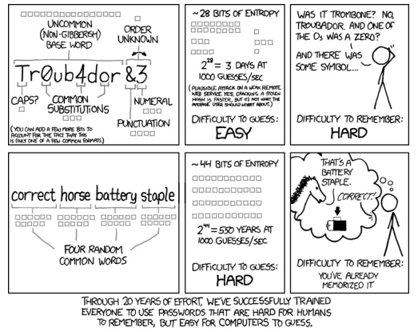

# Authentication
Authentication is the process of verifying a user's identity. There are two reasons that require authentication:

* user identity is a parameter in access control decisions
* user identity is recorded when logging security security relevant events in an audit trial

When a person provide username and password through username announces who he is and through password proves that he is who he claims to be. This type of authentication is called *user authentication*. For obviously reasons password should be secretes shared only between the user and the system.

## Passwords attacks

### Brute force
A brute force attacks is made trying all possible combinations of valid symbols up to a certain length.

#### Mitigations
The main mitigation is to pick password non related to you or in general longest password possible.

### Dictionary
Dictionary attack consist into trying a large number of commonly used names as possible account names and then try a large number of commonly used passwords for the account. List of accounts can be found online.

#### Mitigations
The main mitigation is to change default passwords avoiding guessable passwords. Best practice to create password is explained in following image

{.ui .image .centered}

### Spoofing
Attackers starts a program that presents a fake login screen and leaves the computer. The next user of that machine will enter his credentials and attacker steal them.

#### Mitigations
Main mitigations are:

* display number of failed logins
* trusted path using for example CTRL+ALT+DEL on windows
* use mutual authentication: user authenticated to the system, system authenticated to the user

### Phising
[[[phishing]]]

## Advanced authentication topics

* [[[sso]]]
* [[[saml]]]
* [[[spid]]]
* [[[europeanIdentityInfrastructure]]]
