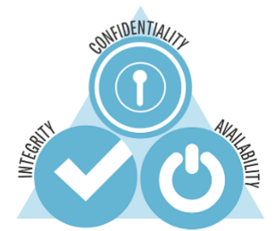

# CIA trade
CIA trade is a trade composed by:

* ***confidentiality*** → prevent unauthorized disclosure of information;
* ***integrity*** → prevent unauthorized modification of information;
* ***availability*** → prevent unauthorized withholding of information or resources.

### Confidentiality
Confidentiality also means protecting personal privacy and proprietary informations. Its goal is to cover all the process form data storage to data processing and finally to the transit over the network.

So preserving authorized restrictions on information access and disclosure is strictly related to preserve personal privacy and proprietary informations.

### Integrity
Integrity grants some terms over informations:

* prevent improper modification or destruction;
* ensure information non-repudiation;
* ensure authenticity of information;

### Availability
Availability ensures timely and reliable access to and use of information. It also grants denial of service or date when user is not authorized.

## Security policy
Set of rules and requirements designed by an organization made for protecting the confidentiality, integrity and availability of its information.

## Security mechanism
Device or function designed to provide one or more security services. It is an implementation of a security policy.

## Security service
A capability that supports one or more of the security requirements.

---
Related arguments:

* [[[risk]]]
