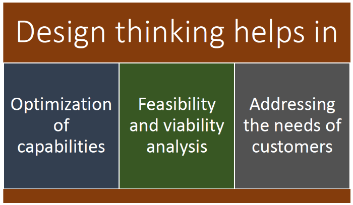
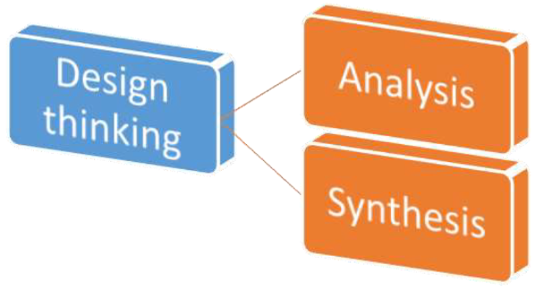
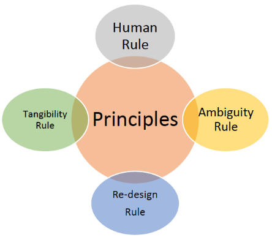
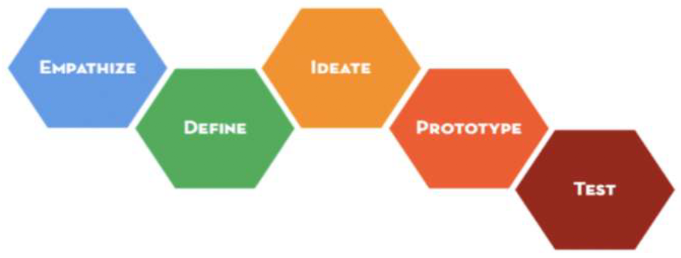
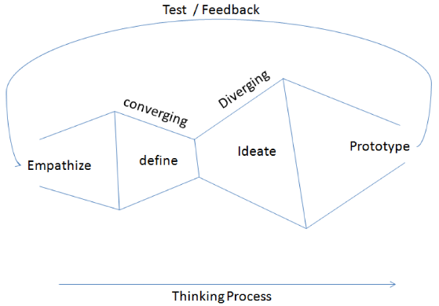

# Design thinking
Design thinking is a methodology that designers use to brainstorm and solve complex problems related to designing and design engineering.

Main features are: 

* __*find simplicity*__
* __*user requirements*__
* __*client expectation*__
* __*appealing product*__
* __*innovative solution*__

Design thinking mindset is focused on solution and not on the problem.

The main goal of design thinking is to focus on solution; the design thinker must have a clear idea of the goal of the entire process. This allow him to explore multiple solutions at the same times.

### Design thinking vs Scientific method
__Scientific method__ is more rigorous, it starts with the definition of all the paramters of the problem.
__Design thinking__ instead aim to find know and ambiguous facets of the problem during the way. We can see *DT* as a iterative way of resolving problems.

### Process of design thinking
Two important concept of *DT* are:

* __*analysis*__ → processo of breaking down something into multiple components that explain better some sub concept;
* __*synthesis*__ → combination of different fragment to explain in a more coincise way a bigger concept.

*DT* can be viewed as the combination between these two concepts

These parts take two different names: __divergent thinking__ and __convergent thinking__.

The main principles behind *DT* are:

During the process thinker can be in two phase:

* __*wicked problems phase*__ → phase when there is a wicked problem that is unknown in some way. For this reason also the solution is unknown;
* __*aha-moment*__ → phase in which thinker suddenly finds his way to clear wicked problems.

#### Five-step process
*DT* process can be viewed as composition of five different activities:

* __empathize__ → activity in which thinker understands user's needs and problems in order to understand better the solution. This process involve *observation*, *engaging* and *watching/listen* users;
* __define__ → activity in which is defined the problem. Data gathered during previous stage is put all together. This stage involve a restyle of the original idea of the thinker;
* __ideate__ → activity in which idea to solve the problem are thought. This can be made with *prototype*, *[[mindmap]]*, *[[whiteboard]]*, *bodystorm*, *sketch* and does not necessary involve only possible, feasible, viable idea;
* __prototype__ → activity in which ideas is checked in order to control the feasibility. After that some are built. The prototype created must be viewed by user for a feedback;
* __test__ → activity in which, after the user's feedback, idea is executed and tested. Tests are made to understand what actually works and what does not.

All of this phases are repeated iteration over iteration.

## Innovation
Innovation is a practice that can be systematically approached by a set of practical and meticulous __tools__, __methodologies__ and __frameworks__

## Analytical thinking
Analytical thinking involves purely __deductive reasoning__ and inductive __local reasoning__ that utilize quantitative methodologies to come to conclusion

## Intuitive thinking
Intuitive thinking to knowing something without any kind of reasoning
