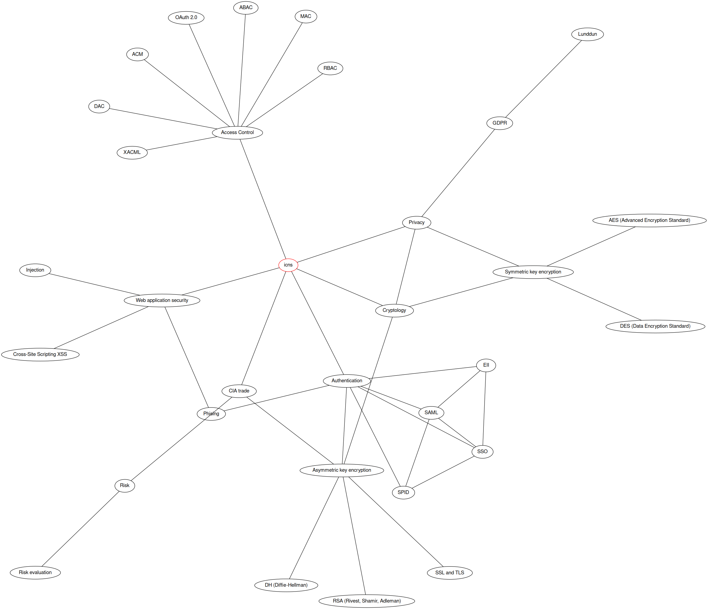

# Introduction to network and computer security
Introduction to network and computer security course of university of Trento.

Some important and very basic definitions:

#### Information security
Practice of preventing unauthorized access, use, disclosure, disruption, modification, inspection, recording or destruction of information.

#### Computer security
Protection of computer system s and information from harm, theft and unauthorized use. Hardware is protected by some physical tool like doors, locks, etc. Informations instead are protected through some system access control.

#### Network security
Practice of preventing physical and software unauthorized access, misure, malfunction, modification, destruction or improper disclosure of networking infrastructure.

#### Cyberspace
Global domain within the information environment. It involves internet infrastructure, telecommunication networks, computer systems and embedded processors and controllers.

#### Cyber attacks
An attacks targeting an organization use of cyberspace purpose of disrupting, disabling, destroying or maliciously controlling a computing environment/infrastructure.

#### Cyber security readiness (CSR)
Ability to have critical information and tools rapidly available and in place in order to proactively identify any types of attacks or problems. Is a parameter used to remain compliant with policy, regulations and laws.

Systems may fail due various reasons:

* *reliability* deals with accidental failures;
* *usability* addresses problems arising from operation mistakes made by users;
* *security* deals with intentional failures: there is at some stage a decision by a person do something he is not suppose to do.

## Knowledge graph

[[z:zettels?tag=university/introductionComputerNetworkSecurity/**&grouped&timeline]]

## TODO list
- [x] in cybersec perspectives slides there is a reference to GDPR. Check if the content is the same inside GDPR and privacy slides
- [ ] think to move CIE 3.0 from sslTLS zettel to a new one
- [x] write better SAML part
- [x] move authentication topics in specific zettel (SSO, SAML, SPID, EII)
