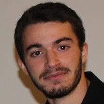

# Zettelkasten

## About me
{.ui .image .right .floated .tiny .avatar}

Hi, my name is Federico Izzo. I'm currently attending [University of Trento](https://www.unitn.it/) for the Bachelor's degree in Computer Science.

I'm working as *junior researcher* at *Data Science for Industry & Physics* (DSIP) for [FBK](https://www.fbk.eu/). Developing deep learning and data science solutions applied to environment/physics fields.

Email:

* federico.izzo99@gmail.com (personal)
* fizzo@fbk.eu (work)
* federico.izzo@studenti.unitn.it (university)

Social:

* [github](https://github.com/fedeizzo) 
* [gitlab](https://gitlab.fbk.eu/fizzo)
* [linkedin](https://www.linkedin.com/in/federico-izzo-1291661a1/)

## Notes

### Regular notes
Regular notes are "traditional" notes, mainly written for university courses.

* [[icns]]#
* [[softwareEngineering2]]#

### Diary notes
This type of notes follow a well defined structure: [[codeDiary]]#

* [[nixOS]]#
* [[haskell]]#
* [[python]]#
* [[zettelsTodo]]#
