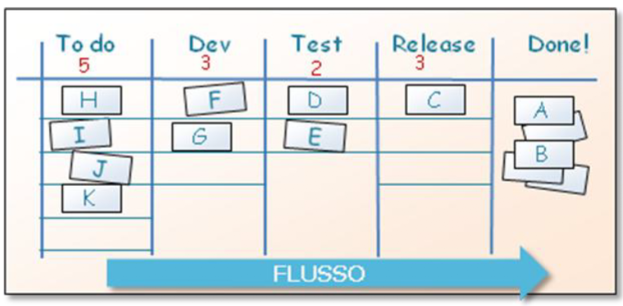
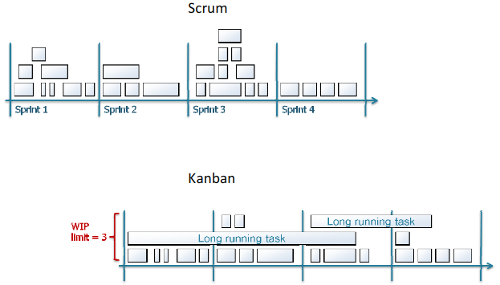
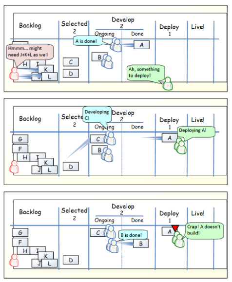

# Kanban
The main idea behind kanban is limit the work in progress (WIP).

Compared to [[scrumDevel]] kanban is more perspective. In a very simple way scrum WIP is limited per unit of time instead kanban WIP is limited per workflow state.

The WIP limit used in kanban is very important:
$$
1)\ low\ limit\to idle\ people\to bad\ productivity
$$
$$
2)\ high\ limit\to idle\ tasks\to bad\ lead\ time
$$

#### Board
In kanban the sprint board is more elastic compared with the scrum board. One specific board can be shared between different teams. For this reason is more complicated

## Summary differences
| Scrum                                                         | Kanban                                                      |
|---------------------------------------------------------------|-------------------------------------------------------------|
| Timeboxed iterations prescribed                               | Timeboxed iterations optional                               |
| Team commits to a specific amount of work for an iteration    | commitment optional                                         |
| uses velocity as default metric for planning                  | Uses lead time as default metric for planning               |
| Cross-functional teams prescribed                             | Cross-functional teams optional. Specialist teams allowed   |
| Items must be broken down so the be completed into one sprint | No particular item size                                     |
| Burndown chart prescribed                                     | No particular type of diagram is prescribed                 |
| WIP limite indirectly (per sprint)                            | WIP limited directly (per workflow state)                   |
| Estimation prescribed                                         | Estimation optional                                         |
| Cannot add items to ongoing iteration                         | Can add new items whenever capacity is available            |
| Sprint backlog is owned by one specific team                  | Kanban board may be shared by multiple teams or individuals |
| Prescribes 3 roles                                            | Does not prescribe any roles                                |
| Scrum board reset between each sprint                         | Kanban board is persistent                                  |
| Prescribes a prioritized product backlog                      | Prioritization is optional                                  |

