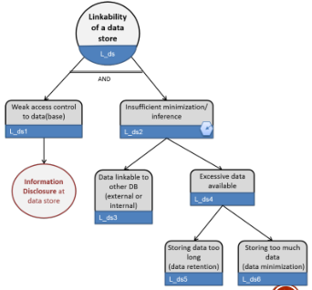
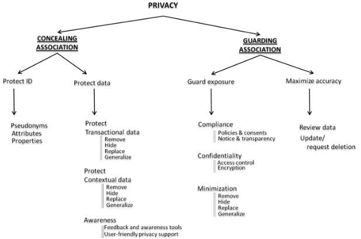

# Lunddun
Lunddun is based on **linkability** concept: being able to sufficiently distinguish whether 2 items of interests (*ioi*) are linked or not, even without knowing the actual identity of the subject of the linkable *ioi*(i.e. web pages visits by the same user).

Consequentially concepts of linkability and lunddun are:

* **identifiability** → when too much linkable information is combined. This can be used to identify the subject within a set of subjects;
* **inference** → when "group data" is linkable, this can lead to social harm;
* **non-repudiation** → not being able to deny a claim;
* **detectability** → being able to sufficiently distinguish whether an ioi exists or not;
* **disclosure of information**
* **unawareness** → being unaware of the consequences of sharing information;
* **non-compliance** → not being compliant with legislations, regulations and corporate policies.

Main mitigations are:

