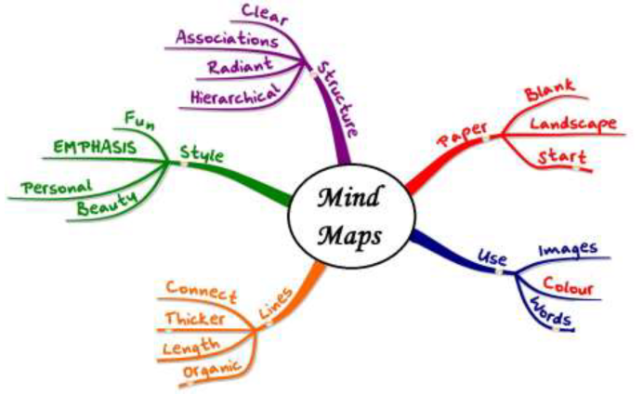

# Mindmap

Mindmap is a visual tool that put problem in the center. After that all possibile solutions or part of them is written all around the center. The solution type can be:

* text
* images
* trees
* other mind maps

## Guidelines
Below are listed some tips in order to make a good mindmap:

1. begin with the problem statement at the center
2. use all possibile solution type with the help of different colors
3. highlight long statements with keywords
4. each word in the map must be connected to the center in some way
5. use radial hierarchy
6. use bold, italic, underline to point better some concepts
