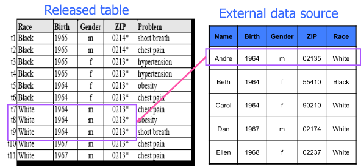
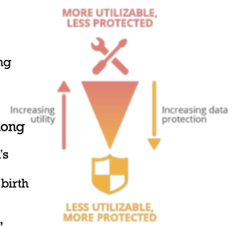
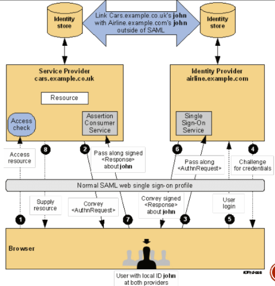
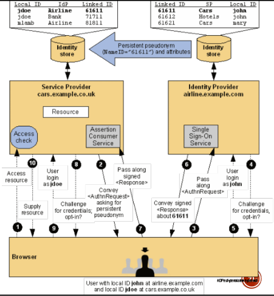
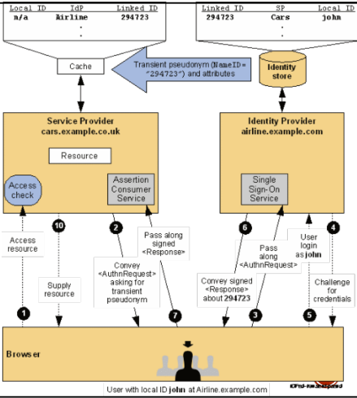

# Privacy
Privacy is the information self-determination, everyone gets to control information about herself/himself. Today there is a high-level of difficult in correlating data/actions and remain anonymous is almost impossible.

In order to become anonymous a person must follow the data anonymization route. He have to remove *Personal Identifying Information(PII)*. But, in some case, data anonymization is not enough and data can be de-anonymized by considering other sources of knowledge. This approach consists into an attack called **Linkage**.

## k-anonymity
There is a mitigation: **k-anonymity**, the information for each person contained in the releases table cannot be distinguished from at least k-1 individuals whose information also appears in the release (there are multiple entries with same values inside the table: birth day, gender, etc.).

A possible implementation is though *Generalization*. It consists in quasi-identifiers replacement with less specific but semantically consistent values until get k identical, example: Age 29, 22, 21 $\to 2^*$.

When too generalization is applied may occur *Suppression*, it means there is too much information loss.

After introducing *Generalization* and *Suppression* we can talk about pseudonymisation function. It allows some utility of the pseudonyms created, taking into account the potential loss of protection caused by this pseudonymisation approach. 

## Pseudonymization function
A pseudonymization function maps identifiers to pseudonyms. Each identifiers can be associated to multiple pseudonyms as long as it is possible for the pseudonymisation entity to invert this operation. There is a table, called pseudonymisation mapping table, containing pseudonymistaion secrets which are used to convert pseudonyms to identifiers.

## Implementation
There are multiples possible implementations:

* ***Counter*** → identifiers are substituted by a number chose by a monotonic counter. A seed s is set to 0 and then it is incremented. Values produced by counter never repeated to prevent ambiguity. It is very simple but can suggest the dataset order.
* ***Pseudo Random Number Generator*** → improvement of counter technique, it is more difficult to implement but there is not sequential issue. 
* ***Cryptographic Hash Function*** → the digest of the identifier is the pseudonym. It is considered inadequate for pseudonymisation as it is prone to brute force and dictionary attacks.
* [[[cryptography]]] or ***Encryption*** → usually block ciphers like the AES[^AES]. They are used to encrypt an identifier using a secret key, which is both the pseudonymisation and recovery secret.

## SAML privacy
SAML supports privacy thought persistent pseudonyms established between an identity and a service provider and one-time or transient identifiers that ensure a stateless concept like http[^http]. These two features are available thanks to an individual local and federated user identities shared between participants.

Without SAML privacy is not ensured when the service provider and the identity provider communicate.

Instead using SAML a **Federation via Persistent Pseudonym Identifiers** is used. Identity provider share and NameID managed internally inside service provider, it decide which information associate with the NameID passed.

The **Federation Using Transient Pseudonym Identifiers** of SAML is

The main difference between Persistent and Transient is that in Persistent the NameID is the same for the entire session and service provider can use it to identify the user internally (in its db). Instead the Transient technique generate a temporary NameID not associated with any username, for this reason the message must contain some information needed by service provider. Without that information service provider is unable to do operations because it does not know user identity.

These SAML feature do not ensure privacy inside Identity Provider, for it pseudonyms must be used also internally of the IdP.

[^AES]: more on AES [[[symmetricKeyEncryption]]]
[^http]: more on stateless http on [[webFundamentals]]
