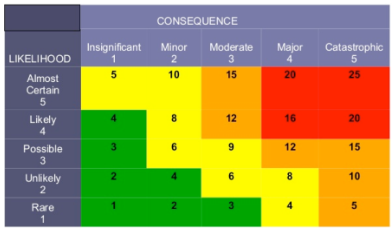

# Risk evaluation
Risk evaluation is based on **measure**, concrete and objective attribute, and **metric**, abstract and somewhat subjective attribute. Metrics can be approximated using a collection of measures. The simplest way to obtain they is: 

1. select metrics
2. determine what measures can support selected metrics

Organizations should have multiple levels of metrics for each type of audience.

Metric accuracy is strictly related to measures accuracies. Main problems related to accuracy are:

* imprecision definition
* ambiguous terminology
* inconsistent measurements methods

Determination of which measures compose a metric is very important, they must change adapting to evolution during the time.

At this point we can define *risk* as:
$$
[\text{Likelihood of adverse event}]\times [\text{Impact of the adverse event}]
$$
and *Likelihood* as:
$$
[\text{Probability exploitable weakness in the sys}]\times [\text{Probability weakness is exploited}]
$$

In cybersecurity an attacker can reduce system information assurance thought a weakness. Stochastic models can be used to predict the probability that this can happen, this techniques is base on vulnerability databases already available. A risk matrix can be used:

{.ui .image .centered}

## CVSS
CVSS is an industrial standard for assessing security vulnerabilities; it attempts to evaluate the degree of risks posed by vulnerabilities. It aims to give values to likelihood and impact.

The score is composed taking known vulnerabilities scores from a major public vulnerability dbs, it also include 2 sub-scores:

* exploitability → measure how easy it is to exploit the vulnerability
* impact → measures how a vulnerability will impact an IT asset in terms of losses in Confidentiality, Integrity and Availability.
