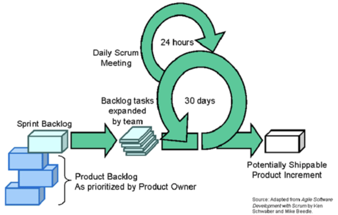
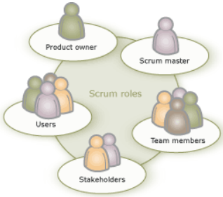
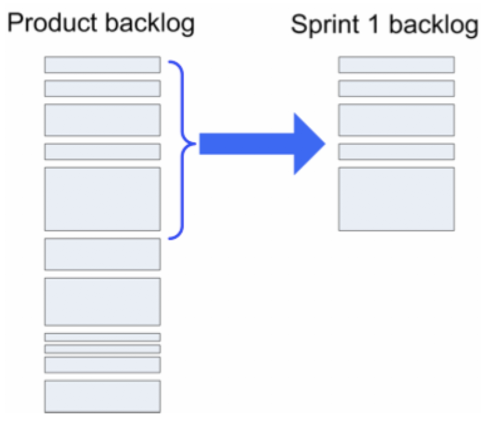
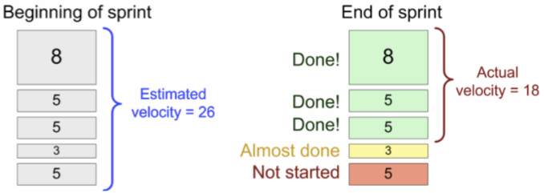
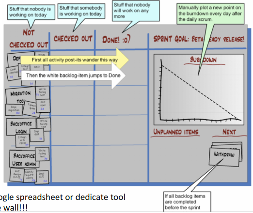

# Scrum
Scrum is an agile development technique

## Roles

* __Product Owner__ → single person who is the product responsible
* __Team__ → ~7 self-organized members
* __Scrum master__ → single person who
    * protect team
    * mange process
    * call meetings
    * help product owner, the team and the organization

## Sprints
A time-limited period of work with defined output. It is the scrum way to define an iteration. Each sprint delivers *potentially shippable* increments working software.

The sprint period is typically from 2 weeks to 2 months.

Sprint content is part of the product backlog. 

#### Estimating velocity
The planning poker methodology:

1. product owner describes a user story;
2. team ask questions to better understand the story until everything is clear;
3. scrum master indicates when do the estimation;
4. each team member provides an estimation;
5. extreme motivation can be motivated;
6. the entire process is repeated until consensus is reached.

#### Potentially shippable
Potentially shippable means tested in functionality, not necessary for performance or usability. In poor word it means good code

#### Sprint planning preparation
Some points that must be respected during preparation:

* product backlog should exist;
* stories specification should be complete;
* product owner should understand each story;
* what do we include in the sprint? Sprint backlog

#### Meetings
There are two types of meetings:

* sprint planning meeting → this type generates:
    * sprint GOAL;
    * list of team members;
    * sprint backlog;
    * demo date;
    * time and place for the daily meetings.
* daily meeting → scrum master must move in the correct way the meeting. In the meeting talk is about:
    * what have you done?
    * what will you do?
    * what impedes you from performing your work as effectively as possible?

#### Sprint backlog

#### Sprint retrospective
Some points that may help in sprint retrospective:

* 1-3 hours meeting;
* everybody talks. Says what was ok, what was not;
* look at estimated vs actual velocity, discuss issues there;
* scrum master summarizes suggestions;
* very often, just recognizing a problem will make it disappear... don't always need to change all the time.
