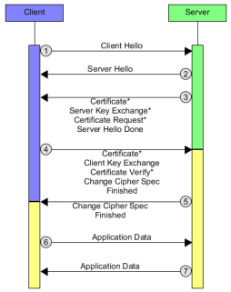

# SSL and TLS

## Digital certificates
A digital certificate is a binding between an entity's Public Key and one or more Attributes concerning its Identity. Entity can be a person, a hardware component, a service, etc.
A digital certificate is issued and signed by someone, usually is a **Trusted Third Party (TTP)**

The standard for certificate is **X.509**

Some questions arise with the use of digital certificate:

* How are digital certificate issued?
* Who is issuing them?
* Why should I trust the certificate issuer?
* How can I check if a certificate is valid?
* How can I revoke a certificate?
* Who is revoking certificates?

All these questions have one answer: **Public Key Infrastructure (PKI)**

### PKI
A PKI is an arrangement that binds public keys with respective identities of entities. This binding is established through a process of registration and issuance of certificates at any by a **Certificate Authority (CA)**. The PKI role that assures valid and correct registration is called a **Registration Authority (RA)**, RA is responsible for accepting request for digital certificates and authenticating the entity making the request. Finally a third-party **Validation Authority (VA)** can provide an entity information on behalf of the CA.

A **Certificate distribution system** is the repository for certificates and the **Certificate Revocation List (CRL)**.

A **Cryptographic Practices Statement (CPS)** is a declaration of the security that the organization is implementing for all certificates issued by the CA holding the CPS.

### Obtaining a certificate

1. User-A generates a public and private key-pair or is assigned by some authority in their organization;
2. User-A first request the certificate of the *CA* server;
3. *CA* responds with its certificate including its public key and its digital signature signed using its private key;
4. User-A gathers all information required by the *CA* server to obtain its certificate;
5. User-A sends a certificate request to *CA* consisting of her public key and additional information. The certificate request is signed by *CA*'s public key;
6. *CA* gets the certificate request, verify User-A's identity and generates a certificate for User-A, binding her identity and her public key. The signature of *CA* verifies the authenticity of the certificate;
7. *CA* issues the certificate to User-A.

## SSL & TLS
SSL, Secure Sockets Layer, developed as a way to secure communications between the client and server on the web (1990s by Netscape). The currently version is SSLv3, others are deprecated.

TLS, Transport Layer Security, has same protocol design to SSL but with different algorithms. The primary goal of TLS is to provide privacy and data integrity between two communication applications, nowadays used to protect information transmitted between browsers and Web Servers. The currently version is TLS 1.3.

A field in which SSL & TLS is HTTPS. It provides:

* authentication of the website and associated web server with which one is communicating
* protection against man-in-the-middle-attack
* bidirectional encryption of communications between a client and server
* protection against eavesdropping and tampering with the contents of the communication

### Architectures
The most used architecture in which TLS is used is **client-server**, there are multiple clients that communicate with a single server. In this case **Transmission Control Protocol (TCP)** is used in order to establish a two-way connection between a server and a single client; it provides reliable byte stream transmission of data with erro checking and correction, and message acknowledgement.

TLS is composed by two main protocols:

* ***handshake*** protocol → use public-key cryptography to establish a shared secret key between the client and the server;
* ***record*** protocol → use the secret key established in the handshake protocol to protect communication between the client and the server.

There are also some additional protocols:

* ***TLS change cipher*** protocol → used to change the encryption being used by the client and the server. Normally used as part of the handshake process to switch to symmetric key encryption;
* ***TLS alert*** protocol → used to report cause of failure.

### Handshake

1. Client send Hello message containing:
    * version of the protocol
    * list of supported cipher suite[^cipher suite]
2. Server send Hello message containing:
    * chosen protocol
    * chosen cipher suite
    * session ID
3. Server send three messages (during this phase RSA or DH are used and TLS verifies server's digital certificate):
    * certificate in X.509 standard (if client request it)
    * server key exchange, used to generate the master key
    * certificate request (if server requires the client to be authenticated)
4. Client send three messages (during this phase RSA or DH are used and TLS verifies client's digital certificate):
    * certificate in X.509 standard (if server send a certificate request)
    * client key exchange (same as above)
    * certificate verify, message that provides explicit verification of the client certificate
5. Server and client send two messages (server before client):
    * change cipher spec
    * hash of the entire handshake process
6. message from client is now encrypted
7. message from server is now encrypted

### TLS authentication
There are two authentication:

* server-side → client uses the server's public key to encrypt the data that is used to compute the secret key. The server can generate the secret key only if it can decrypt that data with the correct private key.
* client-side → server uses the public key in the client certificate to decrypt the data the client sends during step 4 of the handshake process. The exchange of finished messages that are encrypted with the secret key confirms that authentication is complete.

In order to verify the certification during step 3 and 4 TLS verifies:

1. digital signature
2. certificate chain checking intermediate CA certificates
3. expiry, activation dates and the validity period
4. revocation status of the certificate

[^cipher suite]: A cipher suite is a set of algorithms that help secure a network connection that uses TLS. It includes key exchange algorithm, bulk encryption algorithm and a message authentication code (MAC) algorithm. It can also include signatures and an authentication algorithm to help authenticate the server or the client.
