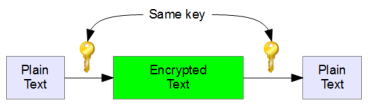
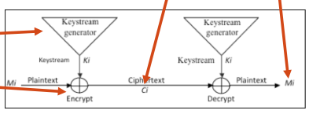
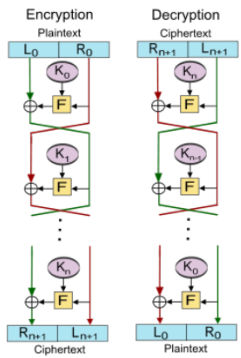

# Symmetric key encryption
Symmetric key encryption is based on one single *key* (k) used for **E** and **D**:
$$
D(k, E(k,p)) = p
$$
All receivers have access to key, for this reason the management of keys is the most important and critic phase.

There are two types of ciphers:

* stream ciphers;
* block ciphers.

### Stream ciphers
Encrypt sequences of short data (1 bit/byte) blocks under a changing key stream. Security relies on design of key stream generato and encryption is computationally simple.

The same plain text bit will be encrypt to a different bit, every time it is encrypted. This types of ciphers is very fast, more than any block ciphers is hardware

In the image a simple representation were made using *XOR* operation.

### Block cipher
A block of plain text is treated as a whole and used to produce a ciphertext block of equal length (between 64 and 256 bits).
A message $M$ is break down into multiple blocks $M_1,M_2,\dots , M_n$ and each one is encrypted with the same key $k$.  

## DES (Data Encryption Standard)
DES is based on **Feistel block-cipher** employing a 56-bit key that operates on 64-bit blocks. DES has 16 rounds of Feistel.

### Feistel
Feistel is a block ciphers base on deterministic algorithm operation on fixed-length groups of bits based on a symmetric key.

#### Working
A round of Feistel is composed by:

1. block of plain text to be encrypted is split into two equal-sized halves $(L,R)$;
2. round function $F$ (substitution) is applied on one half using subkey $K$. Then output is XORed with the other half;
3. two halves are then swapped.

### Cracking
Electronic frontier foundation find that the easiest way to build a practical DES cracker is to have it try every key until it finds the right one. A computer through parallelization can easily find key in a relative short period of time.

### History
Designed by IBM int the 1970s and adopted by NIST in 1977 for commercial and unclassified government applications. It was designed to be faster on hardware than software.

## AES (Advanced Encryption Standard)
AES uses a symmetric key crypto scheme called Rijndael, a block cipher designed by Jaon Daemen and Vincent Rijmen. Algorithm can use a variable block and key length:

* key can be 128, 192 or 256 bits;
* block can be 128, 192 or 256 bits;

### Cracking
AES, allowing key more length, is more secure than DES. In AES there are approximately:

* $3.4\times 10^{38}$ possible 128-bit keys;
* $6.2\times 10^{57}$ possible 192-bit keys;
* $1.1\times 10^{77}$ possible 256-bit keys;

Instead in DES there are approximately:

* $7.2\times 10^{16}$ possible keys;

### History
NIST, in 1997, started the develop of AES in order to gain a better cryptosystem for U.S. government applications. AES become a standard in December 2001.
