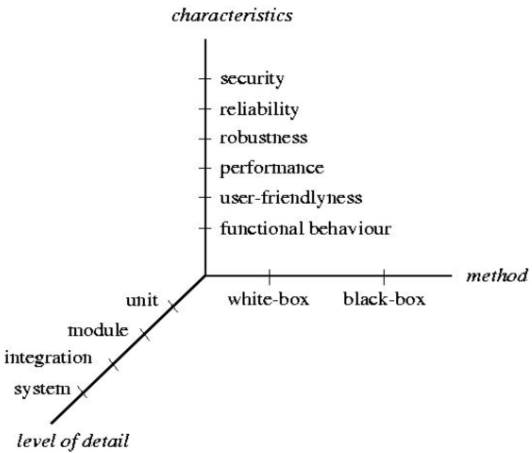
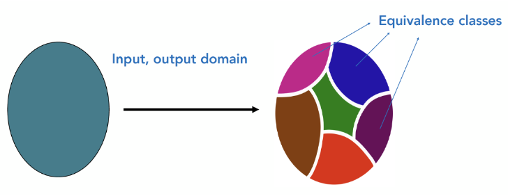
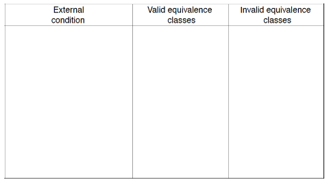

# Test
Software testing is a process, or a series of processes, designed to make sure computer code does what is was designed to do and, conversely, that is does not do anything  unintended.

Tests are about:

* add some value;
* increase quality or reliability of software;
* finding and removing errors.

#### True definition

* your program contains defects. Find them;
* finding defects early means that they are cheaper to fix;
* difficult for you to test your program - because you make implicit assumptions;
* as number of detected defects increase also probability of finding more undetected defects increase;
* testing and debug are easier if code is written well;
* it is only when we think about testing we come up with complete specifications.

## Dimensions of testing

### Level of detail

* __unit testing__ → test a function in an isolated environment;
* __integration testing__ → test multiple functions together. All functions tested during integration must have unit tests;
* __system or validation testing__ → tests if the overall system meets its goals.

### Software testing methods
There are two main types of testing methods:

* __black-box testing__ → examines the functionality of an application without peering into its internal structures or workings (no access to source code). In this type of testing the objective should be to maximize the yield on the testing investment by maximizing the number of errors found by a finite number of test cases;
* __white-box testing__ → tests internal code structures of an application (access to source code). In this type of testing some critical aspects are: large number of paths, missing paths and data-sensitivity errors.

### Test case
A test case is a set of input values, expected output and preconditions for executing a test that aims at finding errors. Obviously a test case fails if expected result is not equal to real result.

A best practice is to setup in a precisely way the test case trying to capture corner cases.

### Code review
Another type of testing involves a group of developers (usually 3 or 4). They read all the code finding errors and not solutions.

### Black-box equivalence partitioning
This techniques is based on an identification of the input of the problem into a multiple classes of inputs.

This type of subsets creation help writing esaustive black-box tests: one test for each input class. This ensure that if a test fails it will fail also on all other items of the same class (if classes were good designed)

#### Class identification
A fundamental part is make a good classes identification. All input must be read and categorized into a class number through:

* input condition → self explanatory;
* valid equivalence classes → represent valid inputs to the program;
* invalid equivalence classes → represent all other possible state of the condition (for example, erroneous input values)

There are some tests that requires some boundary inputs. A boundary input is a data that is between two inputs classes.
