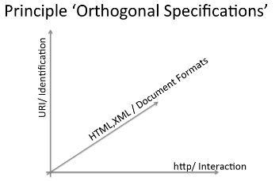
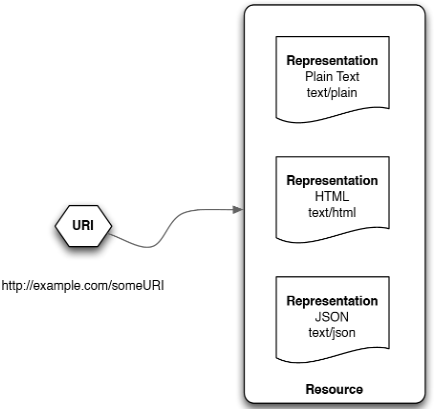
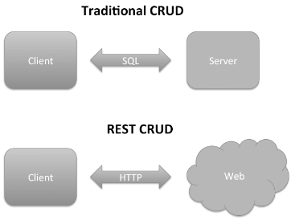

# Web fundamentals
Three architectural components of the web are:

* *identification* → URI (Uniform Resource Identifier)
* *interaction* → HTTP (HyperText Transfer Protocol)
* *standardized document formats* → HTML, XML, JSON, etc.

## URI
__URI__ identify things. HTTP URIs identify things in the web.

## API, Web API and Web Services
__API__ stands for *Application Program Interface* and specifies how software components communicates with each other.

__Web API__ specify how applications communicate with other over the web.

__Web Services__ are built on the design principles and architectural components of the web. They provide certain operation and the communication is made through standard formats 

## Resource-Oriented Architecture
A set of design principles for building __RESTful__ Web Services. The focus is on:

* *addressability*
* *uniform interface*
* *connectedness*
* *statelessness*

#### Addressability
An addressable application exposes the interesting aspects of its dataset as resources through URI support. A resource is anything enough important to be referenced by a URI. For this reason a resource must have at least a URI

#### Uniform interface
The same set of operations applies to everything. Is like a small sets of universal verbs applied to large set of nouns (resources).

With __HTTP__ we have all methods (verbs) we need to manipulate Web resources, this is called __CRUD Interface__. The methods offered by HTTP are:

* *Create* → POST or PUT
* *Read* → GET
* *Update* → PUT
* *Delete* → DELETE

Some definitions:

* __Safe__ → methods can be ignored or repeated without side effects: GET and HEAD
* __Idempotent__ → methods can be repeated without side effects: PUT and DELETE 

| Method |Characteristics                                  |
|--------|-------------------------------------------------|
| POST   | Creates a new resource                          |
| POST   | The server decides on the resource's URI        |
| POST   | Is not idempotent                               |
| PUT    | Creates a new resource                          |
| PUT    | The client decides on the resource's URI        |
| PUT    | Is idempotent                                   |
| GET    | Retrieves the representation of a resource      |
| GET    | Is safe an it does not change state of resource |
| DELETE | Stops a resource from being accessible          |
| DELETE | Logical or physical delete                      |
| DELETE | Is idempotent                                   |

#### Connectedness
In RESTFul services, resources representations are hypermedia. In this way served documents contain not just data but also links to other resources 

#### Statelessness
Every HTTP request is executed in complete isolation. For this reason the request must contain all information necessary for the server in order to complete the task. A simple consequence is that server __never__ relies on information from a previous request.

### RESTFul design
Below is listed some tips for RESTFul design:

1. identify and name resources exposed by service
2. define resource URI
3. model relationships between resources to get more details
4. design an document resource representations
5. assign HTTP method to resources
6. handling errors
7. versioning API
8. pagination
9. actions may not deal with resources. In this case use verbs as name
